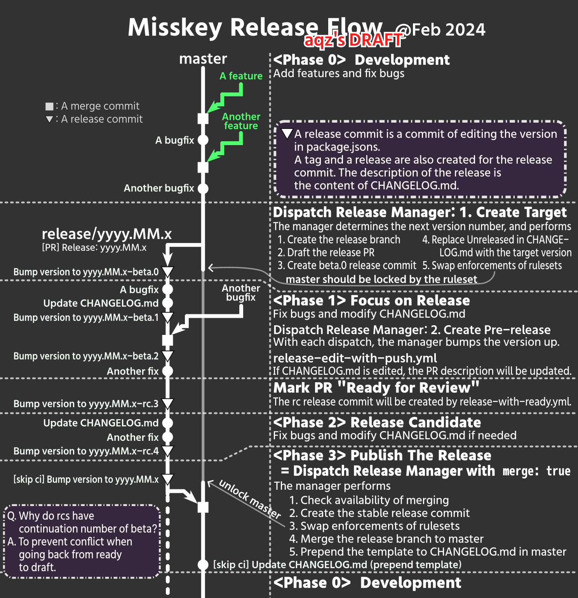

# Release Manager
GitHub Actions workflows for release management of the repository. 

## Flow

## workflows you should copy
Copy and use these workflows.

### release-with-dispatch.yml (Release Manager [Dispatch])
The core workflow that is manually triggered. It has three functions:

1. Prepare release - create release branch, beta.0 tag, and PR
2. Issue a pre-release version during the release process
3. Issue a stable release when you check `MERGE RELEASE BRANCH TO MAIN`

### release-edit-with-push.yml
This workflow changes the description of the PR when CHANGELOG.md is changed.

### release-with-ready.yml
Release rc when PR is ready for review.

## Ruleset management
You can enable/disable ruleset for release working and non-working periods.

To enable ruleset management, you must create an GitHub App with following settings and set `RULESET_EDIT_APP_ID` and `RULESET_EDIT_APP_PRIVATE_KEY` as secrets.  
Reference: https://github.com/actions/create-github-app-token/tree/v1/

|App Settings||
|:--|:--|
|Webhook||
|Active|disabled|
|Repository permission||
|Administration|Read and Write|

Open `Install App` tab and install to the repository or whole the user/organization.

Then create the ruleset(s) you want to use and set its (their) ID to `RULESET_ID_WITHIN_RELEASE` or `RULESET_ID_OUT_OF_RELEASE` as variable(s).  
For example, create a ruleset with enabling `Restrict updates` (to lock the main branch) during the release work period and set it to `RULESET_ID_WITHIN_RELEASE`.

## Repository secrets and variables
### Secrets
<dl>
<dt><code>RULESET_EDIT_APP_ID</code> <i>(optional)</i></dt>
<dd>See Ruleset management</dd>
<dt><code>RULESET_EDIT_APP_PRIVATE_KEY</code> <i>(optional)</i></dt>
<dd>See Ruleset management</dd>
</dl>

### Variables

<dl>
<dt><code>RULESET_ID_WITHIN_RELEASE</code> <i>(optional)</i></dt>
<dd>See Ruleset management</dd>
<dt><code>RULESET_ID_OUT_OF_RELEASE</code> <i>(optional)</i></dt>
<dd>See Ruleset management</dd>
<dt><code>PACKAGE_JSONS_TO_REWRITE</code> <i>(optional)</i></dt>
<dd>package.jsons to rewrite version e.g. <code>"package.json" "packages/misskey-js/package.json"</code></dd>
</dl>
